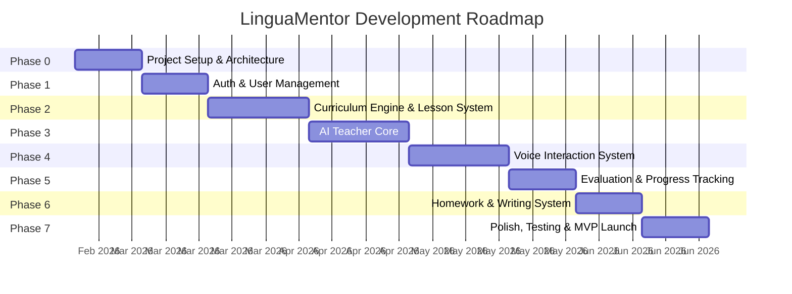

# Language Teacher AI — Development Plan

> **Codename**: LinguaMentor
> **Methodology**: Phased delivery with strict milestone gates
> **Last Updated**: 2026-02-17

---

## Development Phases Overview



---

## Phase 0 — Project Setup & Architecture Foundation

**Goal**: Establish the project skeleton, tooling, CI/CD, and database schema so that all subsequent phases build on a solid foundation.

### 0.1 Repository & Tooling
- [ ] Initialize monorepo structure:
  ```
  /
  ├── apps/
  │   ├── web/          # Next.js frontend
  │   └── api/          # Node.js backend
  ├── packages/
  │   ├── shared/       # Shared types, constants, utilities
  │   ├── ai-core/      # AI service abstraction layer
  │   └── curriculum/   # Curriculum data & logic
  ├── prompts/          # AI prompt templates (versioned)
  ├── docs/
  │   └── adr/          # Architecture Decision Records
  ├── scripts/          # Build, seed, migration scripts
  └── docker/           # Docker configs
  ```
- [ ] Configure TypeScript (strict mode, path aliases)
- [ ] Configure ESLint + Prettier with shared config
- [ ] Set up Husky pre-commit hooks (lint, type-check)
- [ ] Configure conventional commits with commitlint

### 0.2 Backend Skeleton
- [ ] Initialize Express/Fastify server with TypeScript
- [ ] Set up Prisma with PostgreSQL connection
- [ ] Create initial database schema:
  - `users` — id, email, password_hash, name, native_language, created_at
  - `user_profiles` — avatar, timezone, daily_goal_minutes, streak
  - `languages` — code, name, is_active
  - `enrollments` — user_id, language_id, current_level, current_stage, started_at
  - `levels` — id, language_id, order, name, description, required_score_to_advance
  - `stages` — id, level_id, order, name, skill_focus (speaking/listening/writing/reading)
  - `lessons` — id, stage_id, order, type, content_json, duration_minutes
  - `lesson_completions` — user_id, lesson_id, score, started_at, completed_at, attempts
  - `exercises` — id, lesson_id, type, prompt, expected_answer, difficulty
  - `exercise_attempts` — user_id, exercise_id, user_answer, ai_evaluation, score, created_at
  - `voice_sessions` — id, user_id, lesson_id, audio_url, transcript, ai_feedback, duration
  - `homework_assignments` — user_id, assigned_by_lesson, type, prompt, due_date, status
  - `homework_submissions` — id, assignment_id, content, ai_grade, ai_feedback, submitted_at
  - `progress_snapshots` — user_id, language_id, date, vocab_score, grammar_score, speaking_score, listening_score, writing_score
  - `feature_flags` — key, value, description, is_active
  - `prompt_versions` — id, prompt_key, version, content_hash, content, created_at
  - `ai_interaction_logs` — id, user_id, prompt_version_id, input_tokens, output_tokens, latency_ms, created_at
- [ ] Set up Redis connection
- [ ] Create standard API response middleware
- [ ] Set up error handling middleware
- [ ] Set up request logging (structured JSON logs)

### 0.3 Frontend Skeleton
- [ ] Initialize Next.js 14+ with App Router
- [ ] Set up CSS design system:
  - Color palette (dark mode first)
  - Typography scale (using Inter / modern font)
  - Spacing, border-radius, shadow tokens
  - Animation keyframes library
- [ ] Create layout components (AppShell, Sidebar, Header)
- [ ] Set up API client utility with error handling
- [ ] Configure environment variables

### 0.4 DevOps
- [ ] Create `docker-compose.yml` (PostgreSQL, Redis, API, Web)
- [ ] Set up GitHub Actions CI pipeline (lint → type-check → test → build)
- [ ] Create seed script for development data

### Milestone Gate
> ✅ Server starts, connects to DB, serves a health check endpoint.
> ✅ Frontend loads with design system applied.
> ✅ CI pipeline passes on push.
> ✅ Database migrations run successfully.

---

## Phase 1 — Authentication & User Management

**Goal**: Users can register, log in, set up their profile, and select a language to learn.

### 1.1 Backend — Auth Service
- [ ] Implement registration endpoint (`POST /api/v1/auth/register`)
  - Email + password validation (Zod)
  - Password hashing (bcrypt, cost 12)
  - Duplicate email check
  - Return JWT access token + refresh token
- [ ] Implement login endpoint (`POST /api/v1/auth/login`)
- [ ] Implement token refresh endpoint (`POST /api/v1/auth/refresh`)
- [ ] Implement logout endpoint (`POST /api/v1/auth/logout`)
- [ ] Implement password reset flow (email-based)
- [ ] JWT middleware for protected routes
- [ ] Rate limiting middleware (express-rate-limit + Redis store)

### 1.2 Backend — User Profile Service
- [ ] `GET /api/v1/users/me` — get current user profile
- [ ] `PATCH /api/v1/users/me` — update profile (name, native language, timezone, daily goal)
- [ ] `POST /api/v1/users/me/avatar` — upload avatar image
- [ ] `GET /api/v1/languages` — list available languages
- [ ] `POST /api/v1/enrollments` — enroll in a language
- [ ] `GET /api/v1/enrollments` — list user's enrolled languages with progress

### 1.3 Frontend — Auth Pages
- [ ] Registration page — email, password, name, native language selection
- [ ] Login page
- [ ] Password reset page
- [ ] Auth state management (JWT storage, auto-refresh, redirect logic)

### 1.4 Frontend — Onboarding Flow
- [ ] Language selection screen (visually rich grid of language cards)
- [ ] Proficiency self-assessment (Are you a complete beginner? Have some basics? etc.)
- [ ] Daily goal setting (5 min / 15 min / 30 min / 60 min)
- [ ] Welcome screen with teacher introduction

### Milestone Gate
> ✅ User can register, log in, and log out.
> ✅ User can select a language and complete onboarding.
> ✅ JWT auth works correctly with refresh flow.
> ✅ Rate limiting is active and tested.

---

## Phase 2 — Curriculum Engine & Lesson System

**Goal**: Build the structured curriculum framework that defines what users learn and in what order.

### 2.1 Curriculum Data Architecture
- [ ] Define the curriculum hierarchy:
  ```
  Language
  └── Level (A1, A2, B1, B2, C1, C2 — CEFR aligned)
      └── Stage (e.g., "Basic Greetings", "Present Tense", "Restaurant Conversations")
          └── Lesson (individual teaching unit)
              └── Exercise (specific practice item)
  ```
- [ ] Create curriculum data format (JSON schemas for lesson content)
- [ ] Build curriculum seeder for at least **one complete Level (A1)** for **one language (French or Spanish)**
- [ ] Implement lesson types:
  - `vocabulary` — word introduction with audio, image, example sentence
  - `grammar` — rule explanation + structured practice
  - `listening` — audio playback + comprehension questions
  - `speaking` — prompted speech + AI evaluation
  - `conversation` — free-form dialogue with the AI teacher
  - `writing` — written response to prompt + AI grading
  - `review` — spaced repetition of previously learned material

### 2.2 Backend — Lesson Service
- [ ] `GET /api/v1/enrollments/:id/curriculum` — get curriculum tree for enrolled language
- [ ] `GET /api/v1/lessons/:id` — get lesson content
- [ ] `POST /api/v1/lessons/:id/start` — mark lesson as started
- [ ] `POST /api/v1/lessons/:id/complete` — submit lesson completion with score
- [ ] `GET /api/v1/enrollments/:id/next-lesson` — get the next recommended lesson
- [ ] Implement **mastery gating** — user cannot access Stage N+1 until Stage N is completed with minimum score (configurable per level, default 70%)

### 2.3 Backend — Spaced Repetition Engine
- [ ] Implement SM-2 (SuperMemo 2) algorithm for vocabulary review scheduling
- [ ] Track per-word/per-rule mastery scores
- [ ] Generate daily review sessions based on spaced repetition schedule
- [ ] `GET /api/v1/enrollments/:id/review` — get today's review items

### 2.4 Frontend — Lesson Interface
- [ ] Curriculum overview page (visual level map showing progress)
- [ ] Lesson player — renders different exercise types:
  - Vocabulary cards with flip animation
  - Multiple choice questions
  - Fill-in-the-blank exercises
  - Sentence ordering (drag & drop)
  - Translation exercises (both directions)
  - Free text input with AI evaluation
- [ ] Lesson completion screen (score, time, areas for improvement)
- [ ] Review session interface

### Milestone Gate
> ✅ Full A1 curriculum available for one language.
> ✅ User can browse curriculum, start lessons, and complete exercises.
> ✅ Mastery gating prevents skipping ahead.
> ✅ Spaced repetition generates accurate review schedules.

---

## Phase 3 — AI Teacher Core

**Goal**: Build the AI teacher persona that teaches, corrects, evaluates, and converses.

### 3.1 AI Service Abstraction
- [ ] Create `ai-core` package with provider-agnostic interface:
  ```typescript
  interface AIProvider {
    chat(messages: Message[], options: ChatOptions): Promise<AIResponse>
    embedText(text: string): Promise<number[]>
    transcribeAudio(audio: Buffer): Promise<TranscriptionResult>
    synthesizeSpeech(text: string, voice: VoiceConfig): Promise<Buffer>
  }
  ```
- [ ] Implement OpenAI provider
- [ ] Build prompt template engine (variable substitution, version tracking)
- [ ] Create AI interaction logger (every call logged to `ai_interaction_logs`)

### 3.2 Teacher Persona Prompts
- [ ] Design **system prompt** for the AI teacher with:
  - Persona: strict, experienced, patient but demanding
  - Language-specific behavior (speak in target language at appropriate levels)
  - Correction style: always explain the rule, provide correct form, give example
  - Difficulty calibration instructions based on student level
  - Anti-hallucination guardrails for grammar rules
- [ ] Design prompts for each exercise type:
  - Vocabulary introduction prompt
  - Grammar explanation prompt
  - Exercise generation prompt
  - Answer evaluation prompt (with rubric)
  - Conversation prompt (with topic and complexity constraints)
  - Writing feedback prompt (detailed error annotation)
- [ ] Build prompt testing harness — automated tests that verify prompt outputs against expected patterns

### 3.3 Exercise Evaluation Engine
- [ ] **Text answer evaluation**:
  - Exact match for simple exercises
  - Semantic similarity (embeddings) for open-ended answers
  - Grammar error detection and categorization
  - Partial credit scoring
- [ ] **Translation evaluation**:
  - Compare against reference translations
  - Accept valid alternative translations
  - Score for accuracy, grammar, and naturalness
- [ ] **Writing evaluation**:
  - Grammar correctness score
  - Vocabulary range score
  - Coherence and structure score
  - Detailed error annotations with corrections

### 3.4 Dynamic Difficulty Adjustment
- [ ] Track per-skill performance (vocabulary, grammar, listening, speaking, writing)
- [ ] Build difficulty adjustment algorithm:
  - If score > 90% for 3 consecutive exercises → increase difficulty
  - If score < 50% for 2 consecutive exercises → decrease difficulty and provide additional scaffolding
  - Always mix in review of weak areas

### Milestone Gate
> ✅ AI teacher responds in character for all exercise types.
> ✅ Answer evaluation produces accurate scores with helpful feedback.
> ✅ Difficulty adjusts based on student performance.
> ✅ All AI interactions are logged and traceable.

---

## Phase 4 — Voice Interaction System

**Goal**: Enable real-time spoken conversation between the student and the AI teacher.

### 4.1 Speech-to-Text Pipeline
- [ ] Implement audio recording in the browser (MediaRecorder API)
- [ ] Audio preprocessing — format conversion, noise reduction hints
- [ ] Integrate Whisper API for transcription
- [ ] Language-specific transcription configuration
- [ ] Handle partial/streaming transcription for long utterances

### 4.2 Text-to-Speech Pipeline
- [ ] Integrate TTS API (OpenAI TTS or ElevenLabs)
- [ ] Configure teacher voice per language (native-sounding voice per target language)
- [ ] Implement audio streaming to frontend for low-latency playback
- [ ] Cache commonly used phrases (greetings, corrections, encouragements)

### 4.3 Pronunciation Evaluation
- [ ] Build pronunciation scoring pipeline:
  1. Record student speaking a target phrase
  2. Transcribe with Whisper (get word-level timestamps)
  3. Compare transcription against expected text
  4. Score: word accuracy, phonetic closeness, fluency (pauses, speed)
- [ ] Provide specific feedback: "Your 'r' sound in 'rouge' should be more guttural"
- [ ] Track pronunciation weaknesses per phoneme/sound

### 4.4 Voice Conversation Mode
- [ ] Implement WebSocket-based conversation flow:
  1. Teacher speaks (TTS) → plays in browser
  2. Student responds (recorded) → sent to server
  3. Server: STT → AI teacher processes → generates response → TTS
  4. Response played back → loop continues
- [ ] Conversation state management (topic, difficulty, vocabulary constraints)
- [ ] Real-time correction mode — teacher interrupts to correct critical errors
- [ ] Conversation summary and feedback after session ends
- [ ] Save full conversation transcript with AI annotations

### 4.5 Frontend — Voice Classroom
- [ ] Voice recording interface with visual waveform
- [ ] Playback controls for teacher's speech
- [ ] Real-time transcript display (both student and teacher)
- [ ] Pronunciation score visualization
- [ ] "Slow down" button — teacher repeats at slower speed
- [ ] Conversation history with corrections highlighted

### Milestone Gate
> ✅ User can have a full voice conversation with the AI teacher.
> ✅ Pronunciation is scored and specific feedback is given.
> ✅ Conversation feels natural with < 4 second round-trip latency.
> ✅ All voice sessions are recorded and transcribed.

---

## Phase 5 — Evaluation & Progress Tracking

**Goal**: Comprehensive tracking and visualization of the student's learning journey.

### 5.1 Backend — Progress Service
- [ ] `GET /api/v1/progress/:enrollmentId/overview` — overall progress summary
- [ ] `GET /api/v1/progress/:enrollmentId/skills` — per-skill breakdown
- [ ] `GET /api/v1/progress/:enrollmentId/history` — historical performance data
- [ ] `GET /api/v1/progress/:enrollmentId/weak-areas` — AI-identified areas needing work
- [ ] Daily progress snapshot job (cron) — captures skill scores for trend analysis
- [ ] Streak tracking — consecutive days of meeting daily goal

### 5.2 Level Advancement Tests
- [ ] Design comprehensive level tests (A1 → A2, A2 → B1, etc.)
- [ ] Test structure:
  - Vocabulary (25%) — multiple choice, translation, fill-in-the-blank
  - Grammar (25%) — error correction, sentence transformation
  - Listening (25%) — comprehension questions after audio playback
  - Speaking (15%) — pronunciation check + short conversation
  - Writing (10%) — short essay on a prompted topic
- [ ] Minimum passing score: 70% overall, with no individual section below 50%
- [ ] Test results stored with detailed per-section breakdown
- [ ] If failed, AI teacher provides a personalized study plan for weak areas

### 5.3 Frontend — Dashboard & Analytics
- [ ] Main dashboard:
  - Current level and stage
  - Daily streak counter
  - Today's study time vs. goal
  - Quick-start buttons (Continue lesson, Daily review, Practice speaking)
  - Weak areas highlighted with "Practice now" links
- [ ] Detailed progress page:
  - Skill radar chart (vocab, grammar, listening, speaking, writing)
  - Score trend over time (line chart)
  - Vocabulary mastery list (known words, learning, struggled)
  - Grammar rules mastery list
  - Recent lesson scores

### Milestone Gate
> ✅ Dashboard shows accurate, real-time progress data.
> ✅ Level tests work end-to-end and correctly gate advancement.
> ✅ Progress trends are visible over time.
> ✅ Weak areas are correctly identified and actionable.

---

## Phase 6 — Homework & Writing System

**Goal**: The AI teacher assigns homework, students submit, and receive detailed AI-graded feedback.

### 6.1 Backend — Homework Service
- [ ] `POST /api/v1/homework` — AI generates homework based on recent lessons
- [ ] `GET /api/v1/homework` — list assignments (pending, completed, overdue)
- [ ] `GET /api/v1/homework/:id` — get assignment details
- [ ] `POST /api/v1/homework/:id/submit` — submit homework
- [ ] `GET /api/v1/homework/:id/feedback` — get AI feedback on submission

### 6.2 Homework Types
- [ ] **Translation exercises** — translate sentences/paragraphs between languages
- [ ] **Writing prompts** — write about a topic at the appropriate level
  - A1: "Describe your family in 5 sentences"
  - B1: "Write a short email to a colleague about a meeting"
  - C1: "Write an opinion essay about climate change"
- [ ] **Listening comprehension** — listen to audio, answer questions in writing
- [ ] **Grammar drills** — complete exercises targeting specific grammar rules
- [ ] **Journal entry** — daily journal in the target language (free-form)

### 6.3 AI Grading System
- [ ] Detailed error annotation format:
  ```json
  {
    "original": "Je suis allé au magasin hier",
    "corrections": [
      {
        "position": [15, 22],
        "original_text": "magasin",
        "correction": "magasin",
        "type": "correct",
        "note": null
      }
    ],
    "overall_score": 85,
    "grammar_score": 90,
    "vocabulary_score": 80,
    "coherence_score": 85,
    "feedback": "Good work! Your use of passé composé is correct..."
  }
  ```
- [ ] Grading rubric calibrated per level
- [ ] Track most common error types per student (for targeted practice)

### 6.4 Frontend — Homework Interface
- [ ] Homework list view (due dates, status indicators)
- [ ] Submission form (text editor with basic formatting)
- [ ] Feedback view (inline corrections, scores, teacher comments)
- [ ] Homework history and score trends

### Milestone Gate
> ✅ AI assigns contextually appropriate homework.
> ✅ Submissions are graded with detailed, accurate feedback.
> ✅ Error tracking identifies patterns in student mistakes.
> ✅ Full homework cycle works: assign → submit → grade → review.

---

## Phase 7 — Polish, Testing & MVP Launch

**Goal**: Harden the system, achieve test coverage targets, and prepare for initial users.

### 7.1 Testing
- [ ] Achieve 80%+ test coverage on all services
- [ ] Achieve 100% test coverage on evaluation/scoring functions
- [ ] E2E tests for critical flows:
  - Registration → onboarding → first lesson → completion
  - Voice conversation session (with mocked audio)
  - Homework assignment → submission → grading
  - Level test → advancement
- [ ] AI prompt regression tests (snapshot tests for key prompts)
- [ ] Load testing — simulate 100 concurrent users
- [ ] Security audit checklist:
  - SQL injection attempts
  - XSS attempts
  - JWT tampering
  - Rate limit bypass attempts
  - File upload validation

### 7.2 UI/UX Polish
- [ ] Responsive design verification (mobile, tablet, desktop)
- [ ] Accessibility audit (WCAG 2.1 AA compliance)
- [ ] Loading states and skeleton screens for all pages
- [ ] Error states with helpful messages
- [ ] Animations and transitions refined
- [ ] Dark mode as default, light mode as option
- [ ] Onboarding tutorial for new users

### 7.3 Performance Optimization
- [ ] API response time audit — all endpoints < 200ms (non-AI)
- [ ] AI response caching for common patterns
- [ ] Image and audio asset optimization
- [ ] Database query optimization (add indexes, review N+1 queries)
- [ ] Frontend bundle analysis and code splitting

### 7.4 Deployment
- [ ] Production environment setup
- [ ] Environment variable management (secrets manager)
- [ ] Database backup strategy
- [ ] Monitoring and alerting setup (Sentry, uptime checks)
- [ ] SSL/TLS configuration
- [ ] CDN for static assets

### 7.5 Documentation
- [ ] API documentation (OpenAPI/Swagger)
- [ ] User guide for students
- [ ] Developer setup guide
- [ ] Architecture Decision Records (ADRs) for key decisions
- [ ] AI prompt documentation with examples

### Milestone Gate
> ✅ All tests pass. Coverage targets met.
> ✅ App runs smoothly on mobile and desktop.
> ✅ Performance targets are met.
> ✅ Production deployment is successful and stable.
> ✅ MVP is ready for initial users.

---

## Future Phases (Post-MVP)

> These are planned but not scheduled. Priority will be determined based on user feedback after MVP.

### Phase 8 — Social & Gamification
- Leaderboards (opt-in)
- Achievement badges
- Study groups / conversation partners (student-to-student)
- Weekly challenges

### Phase 9 — Advanced Voice Features
- Accent detection and training
- Intonation and rhythm coaching
- Role-play scenarios (ordering at a restaurant, job interview, etc.)
- Listening to native audio clips (podcasts, news) with comprehension exercises

### Phase 10 — Mobile App
- React Native wrapper for iOS and Android
- Offline mode for lessons and vocabulary review
- Push notifications for daily reminders and homework due dates
- Background audio for listening exercises

### Phase 11 — Content Expansion
- Complete curricula for all 8 launch languages (A1–C2)
- Specialized courses (Business language, Travel, Academic)
- User-generated content (community-contributed vocabulary lists)
- Integration with external resources (dictionaries, grammar references)

### Phase 12 — Enterprise & Institutional
- Classroom mode (teacher assigns to multiple students)
- Progress reports for parents/teachers
- SCORM/LTI integration for LMS platforms
- Bulk user management and SSO

---

## Risk Mitigation

| Risk | Impact | Mitigation |
|---|---|---|
| AI generates incorrect grammar rules | High — teaches wrong information | Validate AI outputs against curated grammar databases; prompt regression tests |
| Voice latency too high for natural conversation | High — poor UX | Pre-buffer TTS, implement streaming, use edge servers |
| API costs spiral with many users | Medium — budget | Cache aggressively, use cheaper models for simple tasks, set per-user daily limits |
| Prompt injection by users | High — security | Never interpolate user text into system prompts; sanitize all inputs |
| Database performance degrades with data volume | Medium — performance | Archival strategy, read replicas, efficient indexing |
| Student data privacy regulations | High — legal | GDPR compliance from day one, data deletion endpoints, privacy policy |

---

## Definition of Done (for any feature)

A feature is "done" when:
1. Code is written, typed, and linted.
2. Unit tests pass with required coverage.
3. Integration/E2E tests pass.
4. API documentation is updated.
5. UI matches design specifications.
6. Code is reviewed and approved.
7. Feature works in staging environment.
8. No known bugs or regressions.
